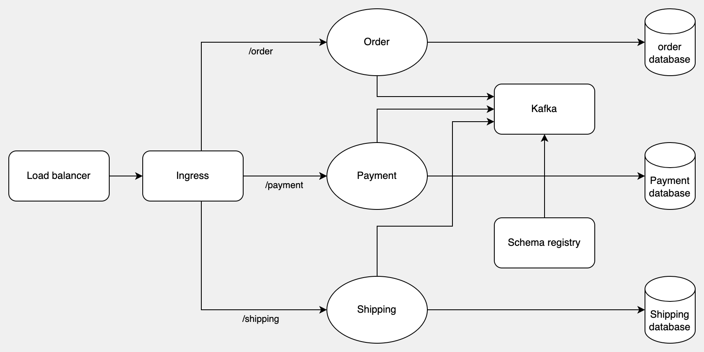

# Vinci

Vinci is a microservice shopping webapp. The name is inspired by my favourite artist - Leonardo da Vinci. 🧑🏻‍🎨

## API-first approach

Vinci chooses [API First approach](https://swagger.io/resources/articles/adopting-an-api-first-approach/) using [Open API 3.0](https://swagger.io/specification/) and [Open API Maven Generator](https://github.com/OpenAPITools/openapi-generator/tree/master/modules/openapi-generator-maven-plugin) to boost API development and allow foreseeing how the product looks like. The generated code can be overridden via [Mustache templates](https://mustache.github.io/mustache.5.html) such as [data transfer object](https://github.com/emeraldhieu/vinci/blob/master/order/src/main/resources/templates/pojo.mustache).

## Message queue

Whenever an order is placed, a corresponding payment record is asynchronouly created for the user to purchase later on. Behind the scene, order service produces Kafka messages and payment service consumes them.

## Schema registry

As Order's Kafka messages tend to evolve by development's needs, [Confluent Avro](https://docs.confluent.io/2.0.0/schema-registry/docs/intro.html) is used to version schemas of Kafka messages. Schemas are stored in Kafka's log files and indices are stored in Avro's in-memory storage. For example, OrderMessage's schema:
```
{
    "type": "record",
    "name": "OrderMessage",
    "namespace": "com.emeraldhieu.vinci.payment",
    "fields":
    [
        {
            "name": "orderId",
            "type": "string"
        }
    ]
}
```

## Database schema change management

[Liquibase](https://docs.liquibase.com/tools-integrations/springboot/springboot.html) supports revisioning, deploying and rolling back database changes. On top of that, it allows [initializing data from CSV](https://docs.liquibase.com/change-types/load-data.html) for demonstrative purpose.

[Flyway](https://flywaydb.org/documentation/usage/plugins/springboot) is similar. It's used to define database structure, bootstrap initial data via SQL statements, and manage database migrations.

## gRPC

[gRPC is said to be faster and more secured than traditional REST API](https://stackoverflow.com/questions/44877606/is-grpchttp-2-faster-than-rest-with-http-2#44937371) because it transmits binary data instead of JSON.

Module `grpc-interface` contains [protobuf3](https://protobuf.dev/programming-guides/proto3/) files to define services, request, and response messages then use [protobuf-maven-plugin](https://github.com/xolstice/protobuf-maven-plugin) to generate Java service stubs. The gRPC server `shipping` implements those stubs to follow the contracts defined in protobuf files.

You can test the gRPC using [grpcurl](https://github.com/fullstorydev/grpcurl).
```shell
grpcurl --plaintext -d '{"id": "d707ada36e6644ddaec63a52e7a40d56"}' localhost:50013 com.emeraldhieu.vinci.shipping.grpc.ShippingService/GetShipping
```

## GraphQL

[GraphQL](https://graphql.org/) is a query language that allows users to retrieve only necessary data in their own way in a single request. [GraphQL for Spring](https://docs.spring.io/spring-graphql/docs/current/reference/html) uses annotations to map handler methods to queries and fields in a GraphQL schema.

Vinci incorporates gRPC into GraphQL. For example, GraphQL `ShippingDetailController#shipping` calls gRPC server to retrieve a `Shipping` in gRPC manner.

This is a simple GraphQL to test.
```shell
curl --location 'http://localhost:50003/graphql' \
--header 'Content-Type: application/json' \
--data '{"query":"{\r\n    shippingDetails(offset: 0, limit: 10, sortOrders: []) {\r\n        id\r\n        amount\r\n        shipping {\r\n            id\r\n            status\r\n        }\r\n    }\r\n}","variables":{}}'
```

Response
```json
{
    "data": {
        "shippingDetails": [
            {
                "id": "ae61181973fd4896a99ecb4089005197",
                "amount": 2.0,
                "shipping": {
                    "id": "d707ada36e6644ddaec63a52e7a40d56",
                    "status": "IN_PROGRESS"
                }
            }
        ]
    }
}
```

## Problem Details RFC-7807

Vinci uses [Spring 6's Problem Details](https://docs.spring.io/spring-framework/docs/6.0.0-RC1/reference/html/web.html#mvc-ann-rest-exceptions) to keep error responses consistent across microservices.

```
{
    "type": "http://localhost:50001/vinci/types",
    "title": "Unprocessable Entity",
    "status": 422,
    "detail": "Invalid sort order",
    "instance": "/orders"
}
```

## Java beans mappings

Like Lombok, [Mapstruct](https://github.com/mapstruct/mapstruct) is a code generator library that supports mapping between entities and DTOs without writing boilerplate code. A significant benefit is that mappers don't need unit tests because there's no code to test!

## Prerequisites

JDK 17, Maven, Docker Desktop.

## Quickstart

#### 1) Build, package, and dockerize the apps

At the module directories of `bom`, `grpc-interface`, `order`, `payment`, and `shipping`, respectively, run this command
```shell
mvn clean install
```

It will take a while. Be patient. :)

NOTE: If you're using Apple Chip, as for `grpc-interface`, run this instead

```shell
mvn clean install -Papple-chip
```

#### 2) Spin up the stack

At the project directory, run this command

```sh
docker compose up -d
```

NOTE: If you're using Apple Chip, uncomment all the lines below in `docker-compse.yml`.

```yml
platform: linux/x86_64
```

#### 3) Verify an API

```shell
curl --location 'http://localhost:50001/orders' \ 
--header 'Content-Type: application/json' \
--data '{
    "products": [
        "coke",
        "juice",
        "cider"
    ]
}'
```

If it returns 201 with a JSON response, the app "order" is working. Check [Order API](#order-api) for other endpoints.

## Deploy microservices to Kubernetes



### Use K3d

[K3d](https://k3d.io/) is a lightweight Kubernetes distribution that supports creating a K8s cluster. This guide assumes you've had K3d [installed](https://k3d.io/v5.4.4/#installation).

#### 1) Set up K8s cluster

Create a local [registry](https://hub.docker.com/_/registry) to store docker images of our apps
```shell
k3d registry create registry42 --port 5050
```

At the project directory, run this
```shell
k3d cluster create cluster42 -p "8080:50001@loadbalancer" --registry-use k3d-registry42:5050 --registry-config k8s/registries.yaml
```

What it does

+ Create a K8s cluster
+ Use an existing docker registry
+ Map host machine's port 8080 to [K3d's loadbalancer](https://k3d.io/v5.3.0/design/defaults/#k3d-loadbalancer)'s port 50001

#### 2) Set up Helm chart

[Helm](https://helm.sh) is a Kubernetes package manager that allows reusing sets of K8s manifests (called "charts"). To make a long story short, Helm chart is similar to Docker image but used for K8s. This guide assumes you've had Helm [installed](https://helm.sh/docs/intro/install/).

At the project directory, run this
```shell
helm install local -f k8s/schema-registry/values.yaml oci://registry-1.docker.io/bitnamicharts/schema-registry --version 10.0.0 
```

What it does

+ Install a Helm chart release named `local` based on [Confluent Schema Registry packaged by Bitnami](https://bitnami.com/stack/schema-registry/helm)
+ Create K8s resources for Kafka and Schema Registry

#### 3) Dockerize apps

3.1) At the directory `order`, build the app
```shell
mvn clean package
```

3.2) Create docker image `order`
```shell
docker build -t localhost:5050/order:1.0-SNAPSHOT .
```

3.3) Push image to the registry
```
docker push localhost:5050/order:1.0-SNAPSHOT
```

Repeat all steps 3.x for `payment` and `shipping`.

#### 4) Apply configuration

Open another terminal, create k8s resources
```shell
kubectl apply -f deployment.yaml
```

#### 5) Verify Postgres

Listen on port 5432, forward data to a pod selected by the service "postgres"
```shell
kubectl port-forward svc/postgres 5432
```

Connect to postgres from the host machine. Enter password "postgres".
```shell
psql -h 127.0.0.1 -d postgres -U postgres -W
```

List databases. If you see databases `order`, `payment`, and `shipping`, the setup is working.
```shell
postgres=# \l
```

#### 6) Verify service "order"

Since K3d Load balancer has routed requests to app services by K8s ingress rules, you won't need port-forwarding. Mind that the context paths `/order` is mandatory.

Create an order on your host machine
```shell
curl --location 'http://localhost:8080/order/orders' \
--header 'Content-Type: application/json' \
--data '{
    "products": [
        "coke",
        "juice",
        "cider"
    ]
}'
```

If it returns a JSON response with an ID, it's working.

#### 7) Verify Schema Registry

Listen on port 8081, forward data to a pod selected by the service "schema-registry"
```shell
kubectl port-forward svc/local-schema-registry 8081
```

Ask for the very first schema of "order"
```shell
curl http://localhost:8081/schemas/ids/1
```

Response
```json
{
    "schema": "{\"type\":\"record\",\"name\":\"OrderMessage\",\"namespace\":\"com.emeraldhieu.vinci.order\",\"fields\":[{\"name\":\"orderId\",\"type\":\"string\"}]}"
}
```

## Order API

Note that the endpoint depends on how you deploy the stack

+ Profile `local`: The endpoint starts with `http://localhost:50001/orders`
+ Profile `k8s`: The endpoint starts with `http://localhost:8080/order/orders`

### 1) List orders

```
GET /orders
```

#### Request parameters (optional)

| Parameters    | Description  | Format                                     |
|---------------|--------------|--------------------------------------------|
| `sortOrders`  | Sort orders  | column1,direction&#124;column2,direction   |

Some examples of `sortOrders`:
+ `createdAt,desc`
+ `updatedAt,desc|createdBy,asc`

#### Example

##### List orders

```sh
curl --location --request GET 'http://localhost:50001/orders?sortOrders=updatedAt,desc|createdBy,asc'
```

##### Response

```json
[
    {
        "id": "0a5eb04756f54776ac7752d3c8fae45b",
        "products":
        [
            "car",
            "bike",
            "house"
        ],
        "createdBy": "20825389f950461b8766c051b9182dd4",
        "createdAt": "2022-11-27T00:00:00",
        "updatedBy": "cca4806536fe4b218c12cdcde4d173df",
        "updatedAt": "2022-11-28T00:00:00"
    }
]
```

### 2) Create an order

```
POST /orders
```

#### Request body

Required parameters

| Parameters | Type | Description      |
|------------|------|------------------|
| `products` | List | List of products |

#### Example

##### Create an order

```sh
curl --location --request POST 'http://localhost:50001/orders' \
--header 'Content-Type: application/json' \
--data-raw '{
    "products": [
        "coke",
        "juice",
        "cider"
    ]
}'
```

##### Response

```json
{
    "id": "ac621782642942e3b9cd239f2ce28575",
    "products":
    [
        "coke",
        "juice",
        "cider"
    ],
    "createdBy": "7f64bc8819ef464aa5dfd704d85a35ef",
    "createdAt": "2023-05-03T09:18:03.589068545",
    "updatedBy": "b5920f1ec6234d199de627bca0e297a2",
    "updatedAt": "2023-05-03T09:18:03.589068545"
}
```

### 3) Get an order

```
GET /orders/<id>
```

#### Path parameters

| Parameters | Description | Type       |
| ---------- |-------------| ---------- |
| `id`       | Order ID    | String     |

#### Example

##### Get an order

```sh
curl --location 'http://localhost:50001/orders/0a5eb04756f54776ac7752d3c8fae45b'
```

##### Response

```json
{
    "id": "0a5eb04756f54776ac7752d3c8fae45b",
    "products":
    [
        "car",
        "bike",
        "house"
    ],
    "createdBy": "20825389f950461b8766c051b9182dd4",
    "createdAt": "2022-11-27T00:00:00",
    "updatedBy": "cca4806536fe4b218c12cdcde4d173df",
    "updatedAt": "2022-11-28T00:00:00"
}
```

### 4) Delete an order

```
DELETE /orders/<id>
```

#### Path parameters

| Parameters | Description | Type       |
| ---------- |-------------| ---------- |
| `id`       | Order ID    | String     |

#### Example

##### Delete an order

```sh
curl --location 'http://localhost:50001/orders/0a5eb04756f54776ac7752d3c8fae45b'
```

Response status is 204 with no content

## TODOs

+ Infrastructure
  + ~~Deploy to K8s~~
  + ~~Scale app services by ingress and loadbalancer~~
  + ~~Scale Kafka by ingress and loadbalancer~~
  + ~~Remove Zookeeper since KDraft was introduced~~
+ App
  + Implement OAuth2
  + Improve database modeling
  + Improve field validation
  + Update README.md for other endpoints
